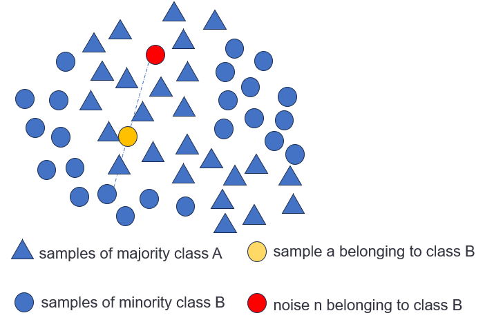

### Overview of Loyalty-SMOTE Algorithm  
The Loyalty-SMOTE algorithm is an improved version of the SMOTE algorithm.  The SMOTE algorithm is the most commonly used method for imbalanced data processing. It achieves sample balance through simple linear interpolation between minority class samples. However, its performance is extremely susceptible to outliers. As shown in the figure, due to the presence of outliers, samples that should belong to class B are mixed into class A. If interpolation is repeated multiple times and this behavior is replicated, it will lead to blurring of the inter-class boundaries and affect the performance of the classifier.

  

To address this issue, we propose the Loyalty-SMOTE algorithm.

### Core Mechanism  
It identifies abnormal samples and boundary samples by calculating the Loyalty of each data point, and performs oversampling specifically on the boundary samples. Details regarding the calculation and properties of Loyalty can be found in our paper.  

### Performance Advantages  
Compared with traditional imbalanced data processing algorithms, the Loyalty-SMOTE algorithm has significantly improved the performance of classifiers, especially on multi-class datasets. For detailed experimental results, please refer to our paper.

### Related Publication  
The paper "Loyalty-SMOTE: Data Synthesis Algorithm for Effective Imbalanced Data Classification" was submitted to the journal *Neural Networks* in November 2024. To facilitate usage for everyone, we have made the code of the Loyalty-SMOTE algorithm and the data used in the paper publicly available. The code is divided into two categories: binary classification and multi-class classification.

