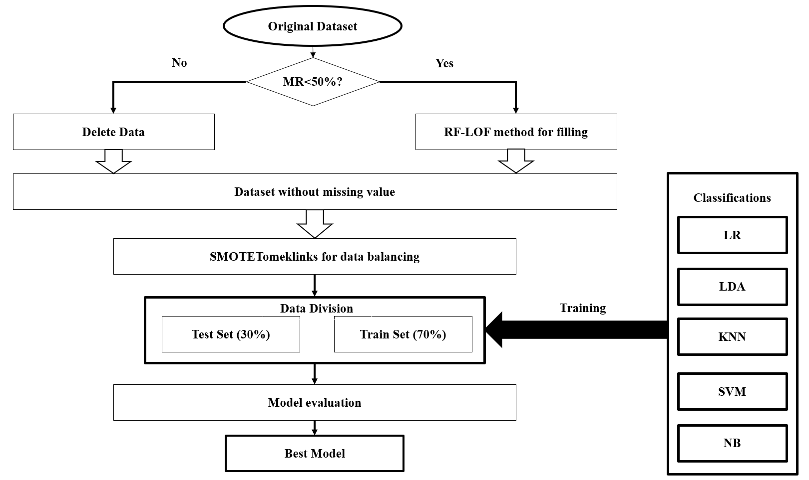
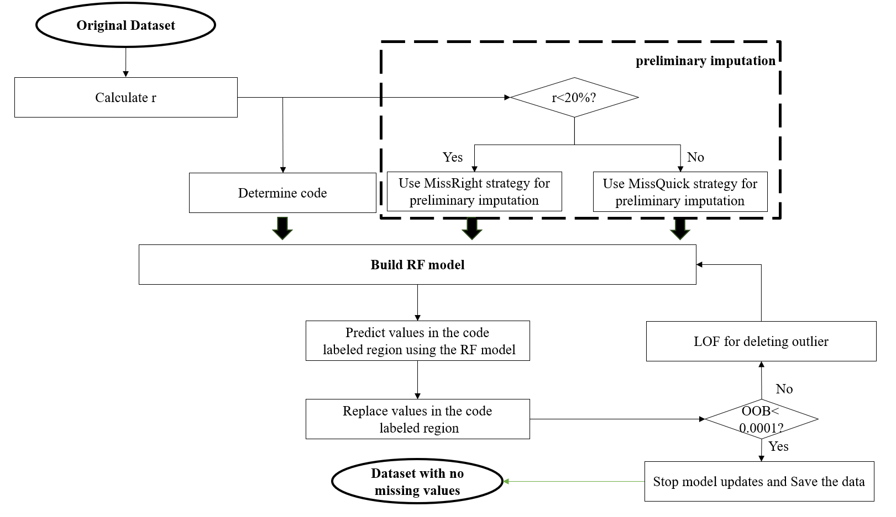

### Overview of RLST-KNN Method  
Imbalanced data refers to a situation in classification tasks where the number of samples in different classes is significantly unequal. For example, in disease prediction, cases of the disease (positive class) are often far fewer than non-disease cases (negative class). This imbalance can lead machine learning models to be biased toward the majority class, resulting in poor performance in predicting the minority class, which is often the focus of interest.
The RLST-KNN method is a machine learning approach specifically designed for the prediction of dairy cow ketosis, with its advantage lying in effectively handling the phenomena of data imbalance and missing data in datasets.  

  

As shown in the flow chart, the RLST-KNN method first processes the missing values in the dairy cow ketosis dataset using the RF-LOF method or direct deletion. Subsequently, the SMOTE-Tomeklinks algorithm is applied for imbalanced data processing, and finally, the KNN classifier is used to realize the prediction of dairy cow ketosis. The selection of all methods is based on performance comparison.

### New missing value handling method
The RF-LOF method is a new missing value imputation method proposed by us, which is used to process dairy cow ketosis data with a missing rate of less than 50%. This method uses the LOF method to suppress the impact of potential outliers in the dataset on RF, thereby improving the accuracy of RF in imputing missing values. The flow chart is as follows.

  

### Performance Comparison  
Compared with traditional machine learning detection methods, the RLST-KNN method has demonstrated stronger performance and robustness in imbalanced dairy cow ketosis data.  Please refer to our paper for the complete experimental results.

### Related Publication  
The relevant paper on this method, *RLST-KNN: An Efficient Machine Learning Method for Prediction of Subclinical Ketosis of Dairy Cows Based on Imbalanced Data Processing Algorithm*, was submitted to the journal *Theriogenology* in April 2025. We have made the code of the RL-LOF algorithm publicly available; however, the dataset remains confidential.
