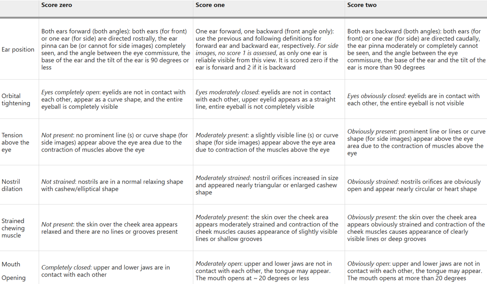

### Scoring Stage of the Pain-Score Method​

The second step of the Pain-Score method is the scoring stage. After segmenting the key parts of the dairy cow's face using Pain-Deeplab and the dairy cow facial pain scale, a deep learning classifier is applied to score each facial organ of the dairy cow individually. The dairy cow facial pain scale stands as a key achievement in the field of veterinary medicine in recent years.

  

To achieve this, we selected appropriate scoring classifiers through comparative experiments to assess the pain levels of each facial organ in dairy cows. The specific experimental results can be referenced in our paper.

### Calculation Method​

  

The following figure shows how each part of the dairy cow's face is scored.

All classifiers use open-source code. We would like to express our sincere thanks to BiliBili blogger "霹雳吧啦Wz" for providing the relevant materials.
https://github.com/WZMIAOMIAO/deep-learning-for-image-processing/tree/master/pytorch_classification

  
